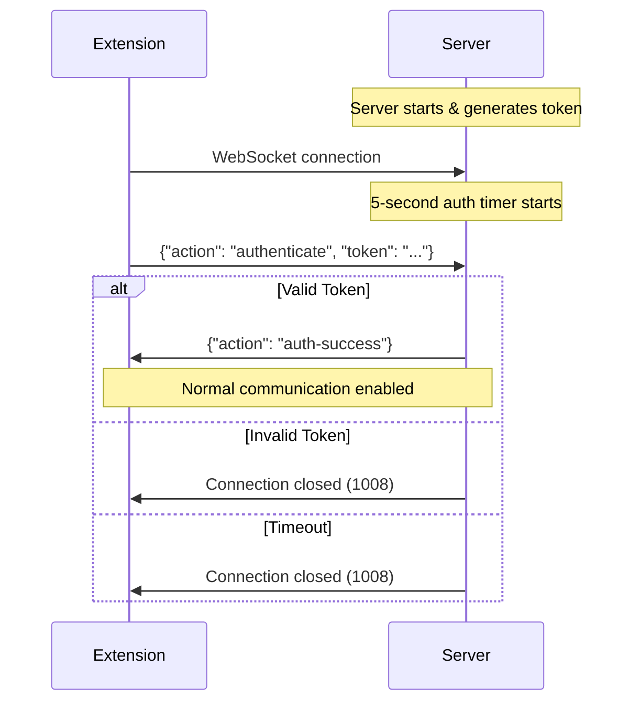

# Team Think MCP Server

A Model Context Protocol (MCP) server that enables programmatic interaction with web-based AI chat interfaces through a secure WebSocket connection.

## Features

- **WebSocket Server**: Listens on port 55156 for browser extension connections
- **Security Handshake**: Ephemeral token-based authentication system
- **Connection Management**: Handles multiple concurrent connections with heartbeat monitoring
- **MCP Protocol**: Exposes tools for interacting with AI chat services

## Security Token System

The server implements a hardened security handshake to prevent unauthorized connections:

### How It Works

1. **Token Generation**: On startup, the server generates a cryptographically secure 32-character token
2. **Token Display**: The token is prominently displayed in the console logs
3. **Authentication Required**: All WebSocket clients must authenticate within 5 seconds of connecting
4. **Connection Rejection**: Invalid or missing tokens result in immediate connection termination

### Finding Your Security Token

When you start the server, look for this output in your console:

```
========================================
SECURITY TOKEN FOR BROWSER EXTENSION:
abc123def456ghi789jkl012mno345pqr
========================================
Configure this token in the extension settings
```

**Important**: The token changes every time you restart the server.

### Configuring the Extension

1. Copy the security token from the server logs
2. Open your browser extension settings
3. Paste the token into the "Server Authentication Token" field
4. The extension will use this token to authenticate with the server

## Authentication Flow



## API Reference

### WebSocket Messages

#### Authentication Message (Extension → Server)
```typescript
{
  "schema": "1.0",
  "timestamp": 1234567890123,
  "action": "authenticate",
  "token": "your-security-token-here"
}
```

#### Authentication Success (Server → Extension)
```typescript
{
  "schema": "1.0", 
  "timestamp": 1234567890123,
  "action": "auth-success",
  "message": "Authentication successful"
}
```

#### Chat Response (Extension → Server)
```typescript
{
  "schema": "1.0",
  "timestamp": 1234567890123,
  "action": "chat-response",
  "requestId": "unique-request-id",
  "response": "AI response text...",
  "error": "optional error message"
}
```

## Development

### Installation

```bash
# Install dependencies
npm install

# Build the server
npm run build
```

### Running the Server

```bash
# Development mode (with auto-restart)
npm run dev

# Production mode
npm run start
```

### Testing Authentication

The server includes test clients to verify authentication:

```bash
# Test authentication with a token
npm run test:auth YOUR_TOKEN_HERE

# Test full workflow (requires token)
npm run test YOUR_TOKEN_HERE
```

### Configuration

Authentication settings can be configured via environment variables:

```bash
# Authentication timeout (default: 5000ms)
export AUTH_TIMEOUT_MS=10000

# Token length (default: 32 characters)  
export TOKEN_LENGTH=64

# WebSocket port (default: 55156)
export WEBSOCKET_PORT=55157
```

## Security Considerations

- **Ephemeral Tokens**: Tokens change on every server restart
- **Constant-Time Validation**: Prevents timing attack vulnerabilities
- **Connection Limits**: Maximum 10 concurrent connections
- **Timeout Protection**: Prevents hanging unauthenticated connections
- **Localhost Only**: Server binds to localhost for security

## Error Codes

| Code | Reason | Description |
|------|--------|-------------|
| 1008 | Policy Violation | Authentication failed or timeout |
| 1011 | Server Error | Token not initialized |
| 1013 | Server Overloaded | Maximum connections exceeded |

## Troubleshooting

### "Connection Refused" Error
- Ensure the server is running: `npm run dev`
- Check the port isn't in use by another process
- Verify you're connecting to the correct port (55156)

### Authentication Failures
- Copy the exact token from server logs (case-sensitive)
- Ensure the server finished starting before connecting
- Check for token expiration (restart server if needed)

### Extension Not Connecting
- Verify the extension has the correct server URL and port
- Check browser console for WebSocket connection errors
- Ensure no firewall is blocking localhost connections

## Architecture

The server is built with:
- **TypeScript** for type safety
- **ws** WebSocket library for real-time communication  
- **Node.js crypto** for secure token generation
- **MCP Protocol** for tool integration

For more details, see the [project documentation](../docs/BLUEPRINT.md).